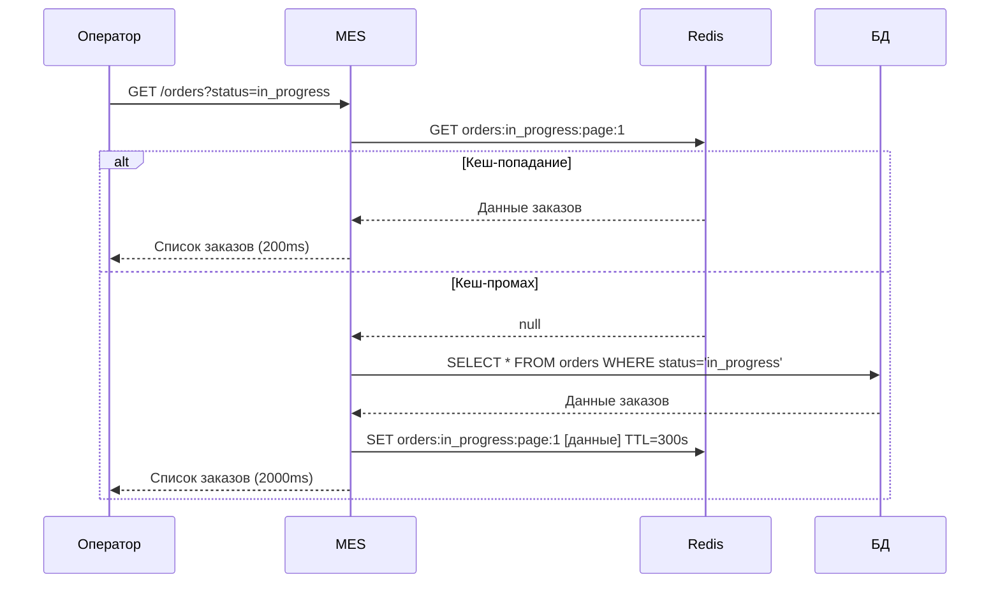
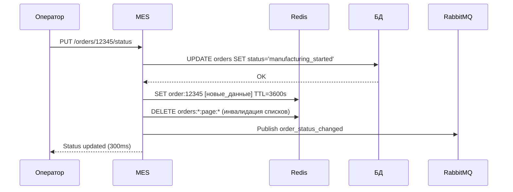
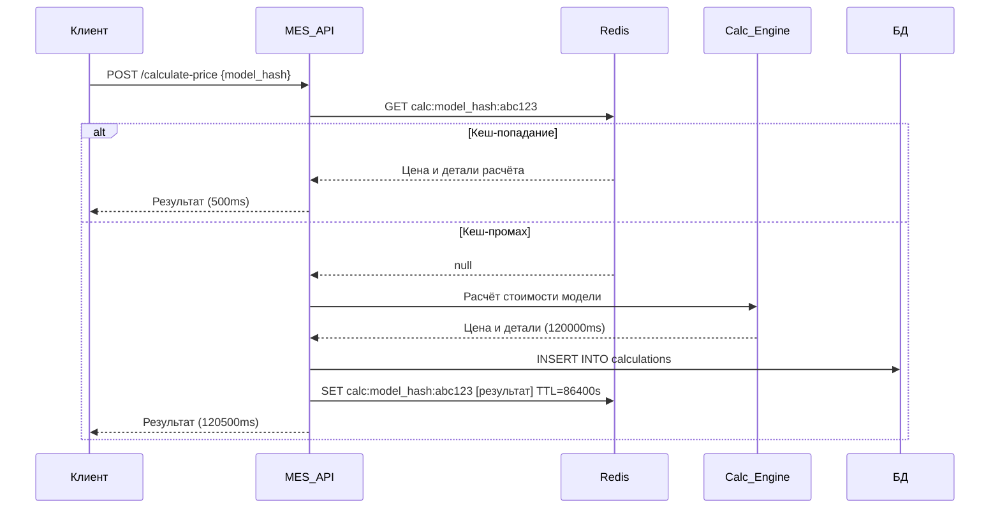

# Архитектурное решение по кешированию для компании «Александрит»

## Анализ проблем системы

### Выявленные проблемы в MES

**Проблемы операторов:**
- Медленная загрузка первой страницы MES с дашбордом заказов
- Долгое ожидание отображения списка заказов в работе
- Неэффективная работа с фильтрами по статусам и пагинацией

**Проблемы внешних клиентов:**
- Медленный расчёт стоимости заказов (2-3 минуты для простых моделей, до 30 минут для сложных)
- Высокая нагрузка на API после открытия для внешних клиентов
- Жалобы на скорость выполнения заказов

### Анализ узких мест

**Основные точки нагрузки:**
1. **Дашборд операторов** - частые запросы списка заказов в работе
2. **API расчёта стоимости** - тяжёлые вычисления на основе 3D-моделей
3. **База данных MES** - множественные запросы к таблицам заказов
4. **Интеграция с RabbitMQ** - обмен сообщениями между системами

## Мотивация

### Зачем внедрять кеширование

Кеширование решает критические проблемы производительности MES и повысит удовлетворённость как операторов, так и внешних клиентов:

**Проблемы, которые решает кеширование:**
1. **Медленная работа дашборда операторов** - кеширование списков заказов
2. **Долгий расчёт стоимости** - кеширование результатов вычислений
3. **Высокая нагрузка на базу данных** - снижение количества запросов
4. **Неэффективная работа API** - кеширование часто запрашиваемых данных

### Элементы системы для кеширования

**Приоритет 1 (критично):**
- **Результаты расчёта стоимости заказов** - основной источник задержек
- **Списки заказов для дашборда операторов** - частые запросы

**Приоритет 2 (важно):**
- **Метаданные 3D-моделей** - ускорение валидации файлов
- **Статистика по производству** - агрегированные данные для отчётов

**Приоритет 3 (желательно):**
- **Справочные данные** - материалы, технологии обработки
- **Настройки пользователей** - персонализация интерфейса

### Ожидаемые результаты

**Технические метрики:**
- Время загрузки дашборда: с 5-10 сек до 0.5-1 сек
- Время расчёта стоимости для повторных моделей: с 2-30 мин до 5-30 сек
- Снижение нагрузки на БД: на 60-80%
- Пропускная способность API: увеличение в 3-5 раз

**Бизнес-метрики:**
- Производительность операторов: рост на 40-50%
- Удовлетворённость внешних клиентов: снижение жалоб на 70%
- Скорость обработки заказов: ускорение на 25-35%

## Предлагаемое решение

### Выбор типа кеширования

**Решение: Серверное кеширование с паттерном Cache-Aside**

**Обоснование выбора серверного кеширования:**
- ✅ **Полный контроль** над логикой кеширования и инвалидации
- ✅ **Единообразие данных** для всех клиентов (операторы + внешние API)
- ✅ **Снижение нагрузки на БД** независимо от количества клиентов
- ✅ **Возможность сложной логики** кеширования для разных типов данных

**Почему не клиентское кеширование:**
- ❌ **Неконтролируемость** - каждый клиент кеширует по-своему
- ❌ **Проблемы консистентности** - сложно синхронизировать изменения
- ❌ **Неэффективность для API** - внешние системы могут не поддерживать HTTP-кеш правильно

### Выбор паттерна кеширования

**Решение: Cache-Aside для чтения + Write-Through для записи**

**Cache-Aside для операций чтения:**

**Преимущества для нашего случая:**
- ✅ **Устойчивость к сбоям** - система работает даже при падении кеша
- ✅ **Гибкость данных** - можем кеширует агрегированные данные отличные от БД
- ✅ **Оптимизация чтения** - именно то, что нужно для дашборда операторов
- ✅ **Простота внедрения** - минимальные изменения в архитектуре

**Write-Through для критичных записей:**

**Применение:**
- Обновление статусов заказов
- Результаты расчёта стоимости
- Изменения в производственных процессах

**Преимущества:**
- ✅ **Консистентность данных** - кеш и БД всегда синхронизированы
- ✅ **Надёжность** - критичные данные сразу попадают в БД

**Почему не другие паттерны:**
- **Read-Through**: Усложняет архитектуру, кеш становится single point of failure
- **Refresh-Ahead**: Требует предсказуемости запросов, не подходит для динамичного API
- **Write-Behind**: Риск потери данных при сбоях, неприемлемо для production

### Диаграмма последовательности действий

#### Операция чтения списка заказов (Cache-Aside)

#### Операция обновления статуса заказа (Write-Through)

#### Операция расчёта стоимости с кешированием

### Технологический стек

**Основной кеш: Redis Cluster**
- **Причина выбора**: высокая производительность, встроенная поддержка TTL, кластеризация
- **Конфигурация**: 3 master + 3 replica для отказоустойчивости
- **Размещение**: отдельные серверы для изоляции нагрузки

**Альтернативы и их недостатки:**
- **Memcached**: нет персистентности, ограниченные типы данных
- **In-memory кеш приложения**: не масштабируется, теряется при перезапуске

### Стратегия инвалидации кеша

Для выбора оптимальной стратегии инвалидации проведём сравнительный анализ в виде таблицы:

| Временная инвалидация | Программная инвалидация | Инвалидация по ключу |
|----------------------|------------------------|---------------------|
| **Лучше подходит, потому что** проста в реализации и гарантирует свежесть данных через заданные интервалы | **Позволяет сделать** мгновенное обновление кеша при изменениях в бизнес-логике | **Позволяет сделать** точечную инвалидацию конкретных данных без влияния на остальной кеш |
| **Есть особенности:** 1) Может показывать устаревшие данные до истечения TTL 2) Не подходит для критично важных данных | **Не позволяет сделать** автоматическую инвалидацию - требует явного вызова во всех точках изменения данных | **Не позволяет сделать** групповую инвалидацию связанных данных - нужно знать все ключи |

**Выбранная стратегия: Комбинированная (программная + временная)**

**Обоснование выбора:**

1. **Программная инвалидация** для критичных данных (статусы заказов, результаты расчётов)
    - Мгновенное обновление при изменении статуса заказа
    - Точный контроль над процессом инвалидации
    - Возможность инвалидации связанных данных

2. **Временная инвалидация** как fallback механизм
    - TTL 5 минут для списков заказов (баланс между производительностью и актуальностью)
    - TTL 24 часа для результатов расчётов (модели редко изменяются)
    - TTL 1 час для метаданных моделей

**Почему не подойдут другие стратегии:**
- **Только временная**: неприемлемо для операторов ждать 5 минут обновления статуса заказа
- **Только программная**: риск забыть инвалидировать кеш в какой-то точке изменения данных
- **Инвалидация на основе запросов**: не все изменения инициируются пользовательскими запросами (например, автоматические процессы)
- **Только по ключу**: сложно отследить все связанные ключи при изменении одной сущности
